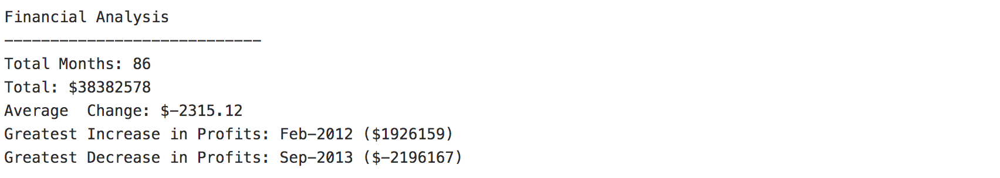

# Python Challenge 
## Synopsis
- In this repository there are __two__ Python Challenges titled PyBank and PyPoll.
#### PyBank

- Created a Python script that analyzes the financial records of a company using the financial data called [Budget Data](/PyBank_Resources/budget_data.csv). The dataset is composed of two columns: `Date` and `Profit/Losses`.
- The Python script calculates the following:
  - The total number of months included in the dataset
  - The net total amount of "Profit/Losses" over the entire period
  - The average of the changes in "Profit/Losses" over the entire period
  - The greatest increase in profits (date and amount) over the entire period
  - The greatest decrease in losses (date and amount) over the entire period
- Printed the final analysis to the terminal and exported a text file with the results.:rocket: 

#### PyPoll

- Created a Python Script for vote-counting processes using the voters data titled [Election Data](/PyPoll_Resources/election_data.csv.zip).
- The dataset is composed of three columns: `Voter ID`, `County`, and `Candidate`. 
- Created a Python script that analyzes the votes and calculates each of the following:
  - The total number of votes cast.
  - A complete list of candidates who received votes.
  - The percentage of votes each candidate won.
  - The total number of votes each candidate won.
  - The winner of the election based on popular vote.
- Printed the final analysis to the terminal and exported a text file with the results.:rocket:

